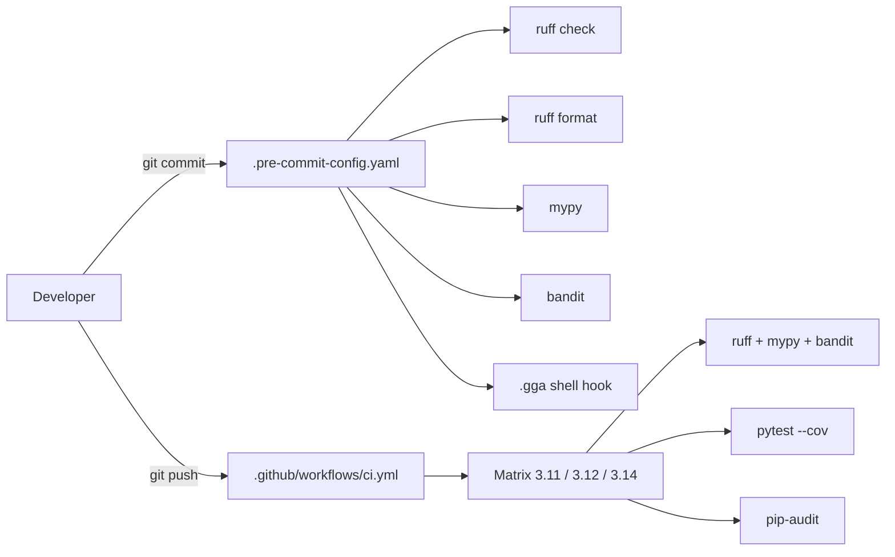

# Design: rama-c-qa-tooling

## Technical Approach

All QA tool config centralizes in `pyproject.toml`. The pre-commit framework (`ruff` → `mypy` → `bandit` → `.gga`) enforces locally; GitHub Actions mirrors the same pipeline in a 3.11/3.12/3.14 matrix. `Makefile` wraps every command for DX parity. PR1 bootstraps tooling + frozen_clock; PR2 fills config/database coverage; PR3 adds integration flows and raises the gate to 70%.



## Architecture Decisions

| Decision | Option A | Option B | Choice | Rationale |
|----------|----------|----------|--------|-----------|
| Frozen clock | `freezegun` library | Homegrown monkey-patch on module import | **`freezegun`** | Supersedes homegrown approach to satisfy spec scenario "test using datetime.now receives the frozen value"; patches globally within fixture scope so both test-side and service-side `datetime.now` see the frozen value |
| Lint + format | Separate ruff.toml | `[tool.ruff]` in pyproject.toml | **pyproject.toml** | Single source of truth; ruff reads it by default without `--config` |
| mypy hook | `pre-commit/mirrors-mypy` (official mirror) | `astral-sh/ruff-pre-commit` includes mypy? | **`pre-commit/mirrors-mypy`** | Canonical mirror repo; pinned to mypy version |
| bandit hook | PyPI `bandit` via `local` hook | `PyCQA/bandit` repo hook | **`local` hook** | PyCQA/bandit repo has no `.pre-commit-hooks.yaml`; `local` wrapping `bandit` CLI is the standard pattern |
| pytest-randomly seed | Random per CI run | Fixed deterministic seed | **Fixed seed `42`** | Reproducible CI; developers can reseed locally via `--randomly-seed=N` |
| Coverage gate | Single global gate | Per-module minimums | **Single global gate** | Simpler config; ratchets cleanly 55→60→70 per PR slice |
| Python 3.14 in matrix | Pin `3.14.0` exactly | `3.14` (latest patch) | **`3.14`** | GitHub Actions `setup-python` resolves latest stable patch; pin `uv.lock` deps instead |

## Tool Version Table

| Tool | Version | Why this version | Source-of-truth config |
|------|---------|------------------|------------------------|
| ruff | `>=0.8,<1` | Fast, single tool for lint + format + isort replacement; 0.8+ stable | `pyproject.toml [tool.ruff]` |
| mypy | `>=1.13,<2` | Stable; PEP 695 support; good discord.py stubs | `pyproject.toml [tool.mypy]` |
| bandit | `>=1.8,<2` | Stable security linter; `--severity-level medium` is default | `pyproject.toml [tool.bandit]` |
| pytest-cov | `>=5.0,<6` | Coverage 7.x integration; `--cov-fail-under` support | `pyproject.toml [tool.pytest.ini_options]` |
| pytest-randomly | `>=3.15,<4` | Deterministic seed support; `--randomly-seed=42` | `pyproject.toml [tool.pytest.ini_options]` |
| hypothesis | `>=6.100,<7` | Stable; `suppress_health_check` support; good shrinking | `pyproject.toml [project.optional-dependencies.dev]` |
| freezegun | `>=1.5,<2` | Canonical Python time-freezing; patches `datetime.now` globally within fixture scope | `pyproject.toml [project.optional-dependencies.dev]` |
| pip-audit | `>=2.7,<3` | Stable; `--strict` flag available | CI workflow only (not in dev deps) |
| pre-commit | `>=3.7,<4` | Stable framework; `SKIP` env var support | Not pinned in pyproject (global install) |
| setup-python | `v5` (Actions) | Latest stable; cache support for pip/uv | `.github/workflows/ci.yml` |

## pyproject.toml Delta

Append these blocks to the existing file:

```toml
# --- QA tooling (rama-c-qa-tooling PR1) ---

[tool.ruff]
target-version = "py311"
line-length = 120

[tool.ruff.lint]
select = [
    "E",    # pycodestyle errors
    "W",    # pycodestyle warnings
    "F",    # pyflakes
    "I",    # isort
    "N",    # pep8-naming
    "UP",   # pyupgrade
    "B",    # flake8-bugbear
    "SIM",  # flake8-simplify
    "RUF",  # ruff-specific rules
]

[tool.ruff.lint.isort]
known-first-party = ["bot"]

[tool.mypy]
python_version = "3.11"
strict_optional = true
warn_unused_ignores = true
disable_error_code = "attr-defined"
# Scoped to bot/bot.py:256-264 ctx._guild_config tech debt.
# Targeted per-file override (narrower than project-wide suppression):
[[tool.mypy.overrides]]
module = "bot.bot"
disable_error_code = ["attr-defined"]

[tool.bandit]
exclude_dirs = ["tests", "dashboard"]

[tool.pytest.ini_options]
asyncio_mode = "auto"
testpaths = ["tests"]
addopts = "--cov=bot --cov-fail-under=55 --randomly-seed=42"
filterwarnings = [
    # discord.py 2.x triggers this under PYTHONASYNCIODEBUG=1
    "ignore:.*coroutine.*is not a coroutine:DeprecationWarning",
    # pytest-asyncio internal deprecation on Python 3.14
    "ignore:.*asyncio.iscoroutinefunction.*:DeprecationWarning",
    # hypothesis deadline flake on slow CI runners (handled via @settings(deadline=None))
    "ignore::hypothesis.errors.HypothesisDeprecationWarning",
]

[project.optional-dependencies.dev]
pytest = ">=8.0"
pytest-asyncio = ">=0.23"
pytest-cov = ">=5.0"
pytest-randomly = ">=3.15"
hypothesis = ">=6.100"
freezegun = ">=1.5"
ruff = ">=0.8"
mypy = ">=1.13"
bandit = ">=1.8"
```

**Gate ratchet plan**: PR1 sets `--cov-fail-under=55`. PR2 changes to `60`. PR3 changes to `70`.

## `.pre-commit-config.yaml` Content

```yaml
# .pre-commit-config.yaml — rama-c-qa-tooling
# Order: fast → slow. SKIP=<hook-id> to bypass per-commit.

repos:
  - repo: https://github.com/pre-commit/pre-commit-hooks
    rev: v5.0.0
    hooks:
      - id: trailing-whitespace
      - id: end-of-file-fixer
      - id: check-yaml
      - id: check-added-large-files

  - repo: https://github.com/astral-sh/ruff-pre-commit
    rev: v0.8.6
    hooks:
      - id: ruff
        args: [--fix]
      - id: ruff-format
        args: [--check]

  - repo: https://github.com/pre-commit/mirrors-mypy
    rev: v1.13.0
    hooks:
      - id: mypy
        args: [--config-file=pyproject.toml]
        additional_dependencies:
          - discord.py-stubs
          - types-PyYAML
        pass_filenames: false
        entry: mypy bot/

  - repo: local
    hooks:
      - id: bandit
        name: bandit
        entry: bandit -r bot/ -c pyproject.toml
        language: system
        pass_filenames: false
        files: ^bot/.*\.py$

      - id: gga
        name: gga
        entry: ./.gga
        language: script
        always_run: true
        verbose: true
        pass_filenames: false
```

**Hook ordering**: pre-commit executes hooks within each repo in listed order, then moves to the next repo. The `local` repo's hooks run in listed order: `bandit` then `gga`. Total order: `pre-commit-hooks` → `ruff` → `ruff-format` → `mypy` → `bandit` → `gga`.

**SKIP support**: Setting `SKIP=mypy,gga` skips those hooks. `SKIP=all` bypasses everything (not recommended).

## `.github/workflows/ci.yml` Structure

```yaml
name: QA

on:
  push:
    branches: ["**"]
  pull_request:
    branches: [master]
  schedule:
    - cron: "0 6 * * 0"  # Sundays 06:00 UTC

permissions:
  contents: read

concurrency:
  group: ci-${{ github.ref }}
  cancel-in-progress: true

env:
  PYTHONASYNCIODEBUG: "1"

jobs:
  qa-matrix:
    runs-on: ubuntu-latest
    strategy:
      fail-fast: false
      matrix:
        python-version: ["3.11", "3.12", "3.14"]
    steps:
      - uses: actions/checkout@v4

      - name: Set up Python ${{ matrix.python-version }}
        uses: actions/setup-python@v5
        with:
          python-version: ${{ matrix.python-version }}

      - name: Cache uv
        uses: actions/cache@v4
        with:
          path: ~/.cache/uv
          key: uv-${{ runner.os }}-${{ matrix.python-version }}-${{ hashFiles('uv.lock') }}
          restore-keys: |
            uv-${{ runner.os }}-${{ matrix.python-version }}-

      - name: Install dependencies
        run: |
          pip install uv
          uv sync --dev

      - name: Ruff check
        run: uv run ruff check bot/

      - name: Ruff format check
        run: uv run ruff format --check bot/

      - name: Mypy
        run: uv run mypy bot/

      - name: Bandit
        run: uv run bandit -r bot/ -c pyproject.toml

      - name: pip-audit
        run: uv run --with pip-audit pip-audit --strict

      - name: Tests with coverage
        run: uv run pytest

      - name: Upload coverage
        if: matrix.python-version == '3.12'
        uses: actions/upload-artifact@v4
        with:
          name: coverage-report
          path: htmlcov/

  pip-audit-weekly:
    runs-on: ubuntu-latest
    if: github.event_name == 'schedule'
    steps:
      - uses: actions/checkout@v4
      - uses: actions/setup-python@v5
        with:
          python-version: "3.12"
      - run: pip install uv && uv sync --dev
      - run: uv run --with pip-audit pip-audit --strict
```

**Notes**:
- `qa-matrix` runs on every push + PR (includes `pip-audit --strict`). `pip-audit-weekly` runs on schedule only (Sundays) for transitive dependency drift.
- Coverage artifact uploaded only from the 3.12 cell (avoids 3 duplicates).
- `concurrency.cancel-in-progress: true` cancels stale CI for the same branch.

## `Makefile` Content

```makefile
.PHONY: lint type security test cov ci audit

lint:
	ruff check bot/
	ruff format --check bot/

type:
	mypy bot/

security:
	bandit -r bot/ -c pyproject.toml

test:
	pytest

cov:
	pytest --cov=bot --cov-report=term --cov-report=html

ci: lint type security test cov

audit:
	uv run --with pip-audit pip-audit --strict
```

## `tests/conftest.py` Extension — `frozen_clock`

**Design decision**: Adopt `freezegun` over homegrown monkey-patch. Rationale: the spec scenario "test using datetime.now receives the frozen value" requires freezing `datetime.now` globally for the test duration — both in test-side direct calls AND service-side access. A homegrown patch targeting only `bot.services.economy_service.datetime` freezes the service's view but NOT the test's own `datetime.now(timezone.utc)` calls. `freezegun` is the canonical Python solution; costs one dev dependency but satisfies the spec contract exactly.

**Migration requirement**: The following test locations use `datetime.now(timezone.utc)` and MUST migrate to `frozen_clock` under PR1:
- `tests/test_economy_service.py` — lines 209, 232, 259, 351, 357, 388, 389, 415, 441 (9 call sites)

```python
# Append to tests/conftest.py

from datetime import datetime, timezone

import pytest
from freezegun import freeze_time

# Frozen deterministic timestamp: 2024-06-15 12:00:00 UTC
_FROZEN_NOW = datetime(2024, 6, 15, 12, 0, 0, tzinfo=timezone.utc)


@pytest.fixture
def frozen_clock():
    """Freeze ``datetime.now()`` to a deterministic value for the test duration.

    Uses ``freezegun.freeze_time`` to globally patch ``datetime.now`` so
    that BOTH test-side direct calls (``datetime.now(timezone.utc)``) AND
    service-side datetime access return the frozen value.  The clock is
    automatically restored when the fixture tears down.

    Usage::

        async def test_cooldown(frozen_clock):
            assert frozen_clock == datetime(2024, 6, 15, 12, 0, 0, tzinfo=timezone.utc)
            # both test code and economy_service.gain_xp() see frozen time
    """
    with freeze_time(_FROZEN_NOW):
        yield _FROZEN_NOW
```

**Tradeoff**: `freezegun` patches `datetime.now` globally for the duration of the `with` block — this is broader than a surgical per-module monkey-patch. However, it is the only approach that satisfies the spec scenario "test using datetime.now receives the frozen value" (both test-side and service-side). The global scope is bounded by the fixture's `with` block and auto-restores on teardown.

**Design note**: Tests that don't call `datetime.now` don't need `frozen_clock`. Convention: if a test's production code path touches `datetime.now(timezone.utc)`, it MUST declare `frozen_clock` in its signature.

## Hypothesis Property Test Pattern

**File**: `tests/property/test_economy_math.py` (PR3 full battery) + `tests/property/test_economy_math_smoke.py` (PR1 scaffold)

**Signature reference** (from `bot/services/economy_service.py`):
```python
@staticmethod
def compute_xp_for_level(level: int, base: int = 100, multiplier: float = 1.5) -> float
@staticmethod
def compute_level(xp: int, base: int = 100, multiplier: float = 1.5) -> int
```

**Strategy bounds** (from spec: levels 0–1000, XP 0–10_000_000):

```python
# tests/property/test_economy_math.py

from hypothesis import given, settings, assume
from hypothesis import strategies as st

from bot.services.economy_service import EconomyService

level_strategy = st.integers(min_value=0, max_value=1000)
xp_strategy = st.integers(min_value=0, max_value=10_000_000)
base_strategy = st.integers(min_value=1, max_value=1000)
multiplier_strategy = st.floats(min_value=1.01, max_value=10.0, allow_nan=False, allow_infinity=False)


@given(level=level_strategy, base=base_strategy, multiplier=multiplier_strategy)
@settings(max_examples=200, deadline=None, suppress_health_check=[])
def test_compute_xp_for_level_positive(level, base, multiplier):
    """XP threshold for any level >= 0 must be non-negative."""
    result = EconomyService.compute_xp_for_level(level, base, multiplier)
    assert result >= 0


@given(
    level_a=st.integers(min_value=0, max_value=999),
    level_b=st.integers(min_value=1, max_value=1000),
    base=base_strategy,
    multiplier=multiplier_strategy,
)
@settings(max_examples=200, deadline=None)
def test_compute_xp_for_level_monotonic(level_a, level_b, base, multiplier):
    """Higher level → higher XP threshold."""
    assume(level_b > level_a)
    xp_a = EconomyService.compute_xp_for_level(level_a, base, multiplier)
    xp_b = EconomyService.compute_xp_for_level(level_b, base, multiplier)
    assert xp_b > xp_a


@given(xp=xp_strategy, base=base_strategy, multiplier=multiplier_strategy)
@settings(max_examples=200, deadline=None)
def test_compute_level_non_negative(xp, base, multiplier):
    """Level must be >= 0 for any valid XP."""
    result = EconomyService.compute_level(xp, base, multiplier)
    assert result >= 0


@given(
    xp_a=xp_strategy,
    xp_b=xp_strategy,
    base=base_strategy,
    multiplier=multiplier_strategy,
)
@settings(max_examples=200, deadline=None)
def test_compute_level_monotonic(xp_a, xp_b, base, multiplier):
    """Higher XP → equal or higher level."""
    assume(xp_b >= xp_a)
    level_a = EconomyService.compute_level(xp_a, base, multiplier)
    level_b = EconomyService.compute_level(xp_b, base, multiplier)
    assert level_b >= level_a
```

**PR1 smoke file** (`tests/property/test_economy_math_smoke.py`): Copy `test_compute_xp_for_level_positive` only — proves hypothesis wiring works.

## Integration Test Pattern

**Infrastructure decision**: REUSE existing conftest mocks (`mock_db`, `mock_interaction`, `cache`). Wire cog → service(db=mock_db, cache=cache). NO new test infrastructure class. All assertions on mock_db method calls + interaction response mocks.

| Flow | File | Class | First test method | Wiring |
|------|------|-------|-------------------|--------|
| Moderation | `tests/integration/test_moderation_flow.py` | `TestModerationFlow` | `test_warn_persists_infraction_and_sends_log_embed` | `InfractionService` + `GuildService` + `LoggingService` → `SentinelCog`. Assert `mock_db.insert_infraction` args + embed content. |
| Ticket | `tests/integration/test_ticket_flow.py` | `TestTicketFlow` | `test_open_ticket_creates_channel_with_correct_permissions` | `TicketService` + `TranscriptService` → `TicketsCog`. Mock `guild.create_text_channel`. Assert permission overwrites + transcript send. |
| XP | `tests/integration/test_xp_flow.py` | `TestXpFlow` | `test_message_accumulation_triggers_level_up` | `EconomyService` → `StellarCog`. Uses `frozen_clock`. Call `gain_xp()` 10+ times. Assert level-up embed + `update_member_xp` args. |

Each file has 2 tests: happy-path round-trip + edge-case (no-log-channel, close-without-transcript, cooldown-prevents-spam).

## Risks Revisited

| Risk | Likelihood | Mitigation | Phase |
|------|------------|------------|-------|
| mypy `attr-defined` override on `bot.bot` doesn't suppress `ctx._guild_config` errors | Low | Per-file `[[tool.mypy.overrides]]` targets `bot.bot` module exactly; test in PR1 | Apply |
| `pre-commit/mirrors-mypy` pinned version drifts from project mypy | Low | `additional_dependencies` in hook config pins mypy version explicitly | Apply |
| `.gga` runs on ALL commits even when no `.py` files staged (`always_run: true`) | Medium | Acceptable cost (~2s); GGA already has fast-exit for no `.py` changes | Apply |
| `freezegun` global scope may cause unexpected side effects in tests that share state | Low | Fixture scope is per-test (`with` block auto-restores); no test-to-test leakage under pytest-randomly | Apply |
| `pytest-randomly` seed=42 may mask order-dependent flakes that only surface with other seeds | Medium | Local developers run `pytest --randomly-seed=0` to reseed; CI uses fixed seed for reproducibility | Verify |
| `bandit` hook uses `language: system` — requires bandit installed globally or in venv | Low | `uv sync --dev` installs bandit; pre-commit runs in project context | Apply |

## Resolutions: Open Questions from Spec Phase

1. **mypy `python_version`** → `python_version = "3.11"`. Matches `requires-python = ">=3.11"` in pyproject.toml. Ensures mypy checks against the minimum supported syntax.

2. **Hypothesis bounds** → levels `[0, 1000]`, XP `[0, 10_000_000]`, base `[1, 1000]`, multiplier `[1.01, 10.0]`. Matches spec's deterministic domain. Multiplier lower bound 1.01 avoids `compute_level` infinite loop at `1.0`.

3. **Bandit severity threshold** → Medium-and-above (bandit default). No override needed; `bandit -r bot/` uses defaults.

4. **pip-audit failure mode** → `--strict` (fail on any vulnerability). Matches the "asyncio debug = ON" philosophy: fail loudly, fix forward.

5. **GGA hook ID** → `gga`. Skip via `SKIP=gga`. Lowercase, no hyphens, matches pre-commit convention.

6. **mypy `pass_filenames: false`** → mypy benefits from whole-module type graph analysis; running on staged-only files can produce false positives due to missing imported context. The hook uses `entry: mypy bot/` with `pass_filenames: false` to always analyze the full `bot/` package, ensuring cross-module type resolution is complete.

## Test File Naming & Directory Layout

```
tests/
  conftest.py                          # extend (frozen_clock fixture)
  test_*.py                            # unit tests (existing, 11 files)
  __init__.py
  integration/
    conftest.py                        # empty or shared integration fixtures if needed
    test_moderation_flow.py            # PR3
    test_ticket_flow.py                # PR3
    test_xp_flow.py                    # PR3
  property/
    conftest.py                        # empty (hypothesis settings if needed)
    test_economy_math_smoke.py         # PR1 — proof-of-pattern
    test_economy_math.py               # PR3 — full battery
```

**Discoverability**: `testpaths = ["tests"]` in pyproject.toml already covers subdirectories. `conftest.py` at `tests/` root applies to all subdirs. No pyproject.toml change needed for layout.

## Anti-patterns / Tech-debt Traps (Apply Phase MUST NOT)

- ❌ Do NOT add `# type: ignore` everywhere — use the per-file `disable_error_code = "attr-defined"` override only
- ❌ Do NOT use `pytest.skip` to bypass flaky tests — fix the underlying determinism with `frozen_clock`
- ❌ Do NOT randomize test execution seed per-CI-cell — seed=42 is fixed for reproducibility
- ❌ Do NOT add tooling tests that test the tooling itself (e.g., "test that bandit finds a vulnerability") — tests must test PRODUCT code
- ❌ Do NOT depend on real Supabase in any test — all DB tests use `AsyncMock(spec=Database)`
- ❌ Do NOT create a homegrown `FrozenDatetime` class — use the `frozen_clock` fixture (freezegun) instead
- ❌ Do NOT pin Python 3.14 to a specific patch version in CI — let `setup-python` resolve latest stable
- ❌ Do NOT add `pip-audit` to dev dependencies — it is installed ephemerally via `uv run --with pip-audit` in both CI and `make audit`; do NOT burn a dev deps slot on a tool that runs in 2 CI cells per push
