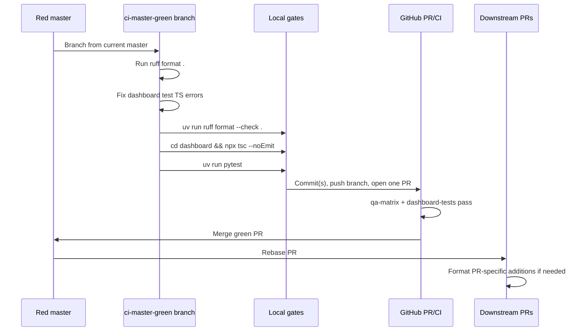

# Design: ci-master-green

## Technical Approach

This is a mechanical tooling fix, not an application architecture change. Implement the user-locked clean-slate approach: run `ruff format .` project-wide, fix dashboard test-only TypeScript errors, keep the existing scoped CI `ruff format --check` invocation unchanged, and deliver everything through one PR. Cache-first, Supabase Realtime CDC, and auth production patterns are N/A — no production behavior or data flow changes are intended.

## Architecture Decisions

| Decision | Alternatives considered | Rationale |
|---|---|---|
| Single PR for master-green recovery | Chained/stacked PRs | Locked by user; the change restores one CI baseline. Splitting a format pass increases coordination cost and can leave master inconsistently formatted. |
| Format project-wide, keep CI format scope unchanged | Format only CI-scoped files; edit CI to check `.` | Project-wide formatting satisfies `ruff format --check .` and avoids immediate re-decay. CI widening is explicitly deferred to `tooling-rigor`. |
| Two work-unit commits inside one PR | One mixed commit; many file/category commits | Commit 1 is pure Python formatting. Commit 2 fixes the independent dashboard type-check gate. This follows work-unit commit guidance: each commit has one purpose, is reviewable, and keeps verification with the unit. |

Recommended commit story:

1. `style: apply ruff formatting project-wide` — only `ruff format .` output.
2. `test: fix dashboard type-check failures` — `ticket-actions.test.ts` type annotation and `middleware.test.ts` import/mock fixes.

## Data Flow / Execution Sequence

## File Changes

| File | Action | Description |
|---|---|---|
| `*.py` project-wide | Modify | Cosmetic `ruff format .`; no Python logic edits. CI-scoped known conflicts include `bot/services/ticket_service.py`, `tests/test_database.py`, `tests/test_migrations.py`, `tests/test_ticket_service.py`, `tests/test_tickets_cog.py`. |
| `dashboard/__tests__/lib/actions/ticket-actions.test.ts` | Modify | Type `guildTicketCategoryId` as `string \| null` so the null category-gate test compiles. |
| `dashboard/__tests__/middleware.test.ts` | Modify | Import `path-to-regexp` from npm package path and include `supabase` in `updateSession()` mock return objects. |
| `.github/workflows/ci.yml` | No change | Scoped format check remains as-is; widening belongs to `tooling-rigor`. |

## Interfaces / Contracts

N/A — mechanical tooling fix, no new public APIs, database schema, Discord command contract, cache contract, or production auth contract. Test mocks must match the existing `updateSession()` return shape: `{ supabaseResponse, supabase, session }`.

## Testing Strategy

| Gate | What to Test | Approach |
|---|---|---|
| Format | Full repository formatting | Before push and before merge confidence: `uv run ruff format --check .`. CI still runs its scoped format check. |
| TypeScript | Dashboard test type errors | Before push: `cd dashboard && npx tsc --noEmit`. CI repeats this in `dashboard-tests`. |
| Python regression | Bot/test suite still passes after formatting | Before push: `uv run pytest`; CI qa-matrix must pass on Python 3.11, 3.12, 3.14. |
| Dashboard regression | Existing Vitest suite | CI runs `cd dashboard && npx vitest run`; run locally if TS fixes touch behavior. |

## Migration / Rollout

No migration required.

After merge, rebase PR #18 (`fix/runtime-bugfixes`) onto green master first. Expect formatting-only conflicts in the five shared CI-scope Python files. During rebase, current/ours is formatted master and incoming/theirs is PR #18; preserve PR #18 logic, accept master formatting for unchanged lines, then run `uv run ruff format <five touched files>` or `uv run ruff format .`. If reformatting changes PR #18 files, add a fixup commit on PR #18 documenting the post-rebase formatting. Then rebase PR #19 and PR #20 onto the updated green master.

Rollback: one PR means one rollback unit. Prefer squash merge for a single revert commit; otherwise use GitHub Revert or `git revert -m 1 <merge-sha>` for a merge commit. No data cleanup is needed.

## Open Questions

None.
