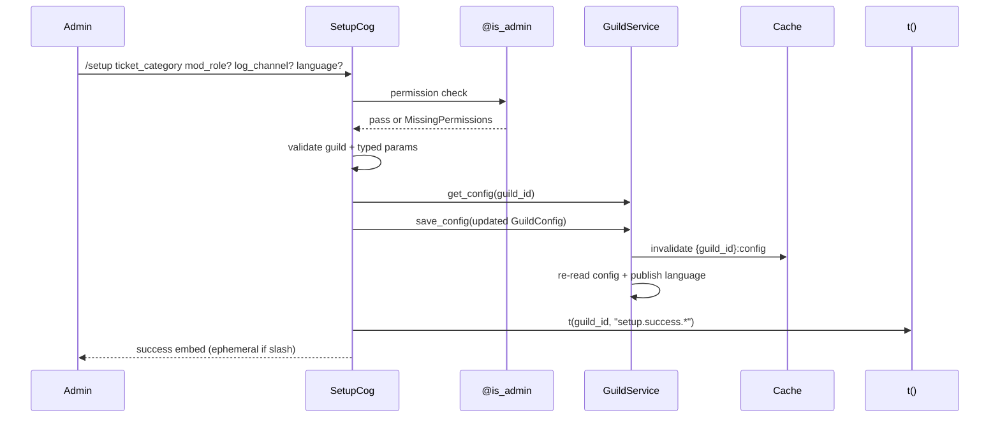
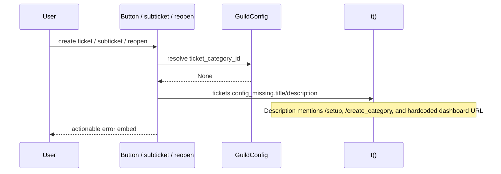

# Design: Ticket Category ID Null Setup Fix

## Technical Approach

Add a focused `SetupCog` for guild configuration interaction, keep ticket lifecycle logic in `TicketsCog`, and continue persisting through `GuildService.save_config()`. The change is command/copy/UI only: no schema, auth, CDC, or new cache architecture. `GuildService.save_config()` already upserts, invalidates `{guild_id}:config`, and re-reads, so the existing cache-first path is reused.

## Architecture Decisions

| Decision | Choice | Alternatives considered | Rationale |
|---|---|---|---|
| Setup location | Create `bot/cogs/setup.py` with `SetupCog`; load it in `bot/bot.py` | Extend `TicketsCog` | `TicketsCog` is already large and ticket-lifecycle-heavy. Setup is guild configuration interaction and should stay isolated while still delegating persistence to `GuildService`. |
| Setup response visibility | Slash: ephemeral. Prefix: normal channel response | Always channel, always ephemeral | AGENTS.md requires private slash errors/responses and channel embeds for prefix. Use `ctx.interaction is not None` to set `ephemeral`. |
| Error text ownership | Use `t(guild_id, "tickets.config_missing.*")` in cog-visible paths; `TicketService` raises a typed `TicketCategoryNotConfiguredError` for reopen | Hardcoded strings in each flow | One i18n key keeps `/setup`, `/create_category`, and dashboard URL wording consistent. Service remains business-layer; cog owns user-facing i18n. |
| Delivery | Single PR, split into work-unit commits | Chained PRs | Forecast is ~200-300 lines, below the 800-line budget. Work-unit commits preserve review story without PR fragmentation. |

## Data Flow





## File Changes

| File | Action | Description |
|---|---|---|
| `bot/cogs/setup.py` | Create | `SetupCog` with `@commands.hybrid_command(name="setup")`, `@is_admin()`, typed params: `ticket_category: discord.CategoryChannel`, `mod_role: discord.Role | None`, `log_channel: discord.TextChannel | None`, `language: Literal["es", "en"] | None`. |
| `bot/bot.py` | Modify | Load `bot.cogs.setup` during `setup_hook()` before tree sync. |
| `bot/cogs/tickets.py` | Modify | Replace ticket-category-null errors in `_CategorySelect.callback`, `/subticket create`, and `/reopen` catch with i18n actionable embed helper. |
| `bot/services/ticket_service.py` | Modify | Raise `TicketCategoryNotConfiguredError` when reopen cannot resolve the Discord category; keep audit insert. |
| `bot/locales/en.json`, `bot/locales/es.json` | Modify | Add setup and missing-config strings. Dashboard URL is hardcoded in the locale value, e.g. `https://nebulosabot-dashboard.vercel.app`. |
| `dashboard/app/(authenticated)/guilds/[guildId]/config/page.tsx` | Modify | Change ticket category field copy to `Discord Category Channel ID (right-click → Copy Channel ID)`. |
| `tests/test_setup_cog.py`, `tests/test_tickets_cog.py`, `tests/test_ticket_service.py`, dashboard config test | Create/Modify | Add TDD coverage for setup, error wording, service exception, and dashboard label. |

## Interfaces / Contracts

`/setup` preserves omitted optional values:

```python
async def setup_command(
    ctx: commands.Context,
    ticket_category: discord.CategoryChannel,
    mod_role: discord.Role | None = None,
    log_channel: discord.TextChannel | None = None,
    language: Literal["es", "en"] | None = None,
) -> None: ...
```

i18n keys: `setup.success_title`, `setup.success_description`, `setup.error_title`, `tickets.config_missing.title`, `tickets.config_missing.description`.

## Testing Strategy

| Layer | What to Test | Approach |
|---|---|---|
| Unit | `/setup` permission metadata, required typed category, optional preservation, `save_config`, i18n success | Mock `commands.Context`, `GuildConfig`, and `guild_service`. |
| Unit | All three missing-category flows mention `/setup`, `/create_category`, dashboard URL | Assert embed descriptions in `test_tickets_cog.py`; assert typed service exception in `test_ticket_service.py`. |
| Dashboard | Config page renders corrected ticket category label | Vitest/Testing Library server-component render or extracted field assertion. |

## Commit Structure

1. `feat(bot): add setup command for ticket category config` — `SetupCog`, bot loading, setup tests.
2. `fix(tickets): surface actionable missing category guidance` — i18n keys, ticket flow/service updates, tests.
3. `fix(dashboard): clarify ticket category id label` — dashboard copy + Vitest test.

## Migration / Rollout

No migration required. Existing guilds self-heal when admins run `/setup`; cache invalidation is handled by `GuildService.save_config()`.

## Non-Applicability

Cache-first/CDC/auth patterns are not changed. This only uses the existing guild config save path.

## Open Questions

None.
