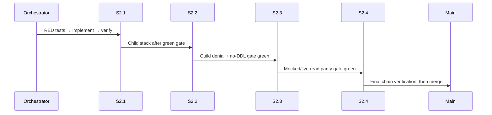
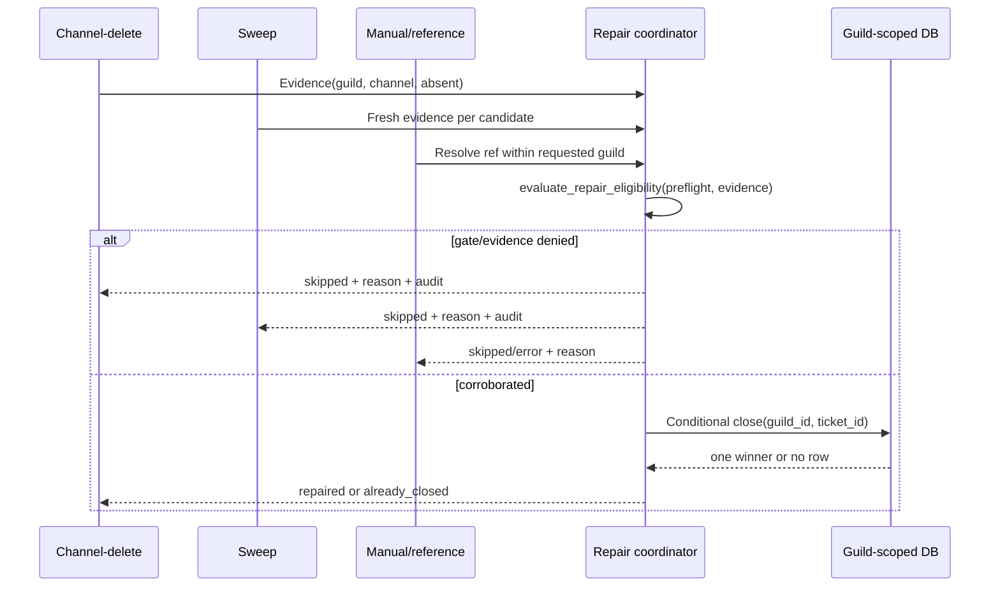

# Design: Refactor Ticket Domain S2

S2 creates bounded seams, not a literal 4,260-line relocation. `TicketService`, `TicketsCog`, `TicketPanelView`, and `TicketActionsView` remain facades; IDs stay `ticket:open`, `ticket:claim`, `ticket:close`, and `ticket:edit-category`.

## Technical Approach

Deliver **A toward B**: extract lifecycle/query/repair seams now; move toward domain/application/infrastructure modules in S3. Four stacked slices stay below 800 lines:

| Slice | Boundary |
|---|---|
| S2.1 | Typed `NebulosaContext`, 28 test-mypy fixes, and `is_mod` characterization; no permission change. |
| S2.2 | Guild-aware DB entry points and one caller vertical. |
| S2.3 | Credential-gated read-only metadata binder into `SchemaInventory`; no DDL. |
| S2.4 | Repair adapters behind `TicketService`; one coordinator. |

Blast radius: 31 service callers, 23 `is_mod` decorator callers, 21 inline callers, persistent-view registration, and `ticket.categoryId` TEXT versus `ticket_category.id` UUID.

## Architecture Decisions

| Decision | Choice | Alternatives and rationale |
|---|---|---|
| Incremental A → B | Extract one behavior slice behind facades. | Alternative: literal move; it exceeds the review budget and destabilizes callers. |
| Zero-policy RLS | Keep nine RLS/no-policy tables service-role-only. `DatabaseBase.connect()` validates JWT role before `acreate_client`; anon/publishable fail closed. | Policies would invent an unapproved client model; removing RLS is unsafe. |
| Note/audit retention | Future policy: note `CASCADE`; audit retention with nullable `ticketId`/`SET NULL` plus time retention. | Notes are disposable; audit is evidence. Live FKs are absent and audit `ticketId` is `NOT NULL`; S2 verifies only, S3 owns DDL. |
| Context typing | Use `NebulosaContext`; use `commands.Context[NebulosaBot]` only for interoperability. | `Context[Any]` hides narrowing, service ownership, and `Context.interaction`, preserving 28 errors. |
| Live verifier order | Compare live FK/RLS/policy/publication/index/migration metadata before DDL. | DDL-first makes parity uncertainty irreversible; drift stays unresolved and fail-closed. |

## Data Flow





```mermaid
sequenceDiagram
    participant A as Guild A caller
    participant F as Facade
    participant D as Database
    A->>F: get/update ticket B with guild A
    F->>D: WHERE guildId=A AND id=B
    D-->>F: no eligible row
    F-->>A: denial/empty result; no mutation
```

## File Changes

| File | Action | Description |
|---|---|---|
| `bot/core/context.py`, `bot/cogs/{sentinel,utility}.py`, `bot/utils/checks.py` | Modify | Typed callbacks; preserve both paths. |
| `bot/core/db/ticket{,_category,_note,_audit}_db.py` | Modify | Enforce ownership across 12 gaps. |
| `bot/services/ticket_service.py`, `bot/cogs/tickets.py`, `bot/views/tickets.py` | Modify | Preserve facades; migrate one vertical path; extract repair seam. |
| `bot/services/schema_inventory.py`, `bot/services/integrity_report.py`, `bot/bot.py`, `bot/listeners/audit_listener.py` | Modify | Bind read-only evidence; retain startup guard; pass fail-closed preflight. |
| `tests/` | Modify/Create | RED-first typing, ownership, parity, repair, and view-registration contracts. |

## Interfaces / Contracts

```python
def evaluate_repair_eligibility(*, preflight_allows: bool,
                                corroborated: bool | None) -> tuple[str, str] | None: ...

async def get_ticket(self, ticket_id: str, *, guild_id: str) -> dict[str, Any] | None: ...
async def transition_ticket_to_closed(self, guild_id: str, ticket_id: str, ...) -> dict[str, Any] | None: ...
```

`SchemaInventory` reports typed counts, named sets, freshness, and reasons. `no_ddl` remains true; unresolved evidence never authorizes repair.

## Testing Strategy

| Layer | Coverage |
|---|---|
| Unit | Dual permissions, typed contexts, 12 guild filters, verifier counts/reasons, eligibility. |
| Integration | Mock query predicates, cross-guild denial, close race, adapter convergence. |
| Opt-in live | Credential-gated reads; absent credentials skip; default pytest remains independent. |

## Threat Matrix

All rows are **N/A** because delivery choreography adds no boundary implementation or RED tests:

| Boundary | Applicability |
|---|---|
| Documentation-like paths | N/A — no executable-file classification. |
| Git repository selection | N/A — no path-selection command. |
| Commit state | N/A — no staging/commit command. |
| Push state | N/A — no refspec/push command. |
| PR commands | N/A — orchestrator owns the stack, not product code. |

## Migration / Rollout

No schema mutation in S2: S2.1–S2.2 code-only, S2.3 read-only, S2.4 facade-only. Rollback per slice: S2.1 revert typing/tests; S2.2 revert guild callers/mixins; S2.3 disable the verifier and return unresolved inventory; S2.4 restore monolithic repair. View registration and IDs stay unchanged.

## Open Questions

None for S2. Future FK/RLS DDL and the full physical split are S3 decisions.
