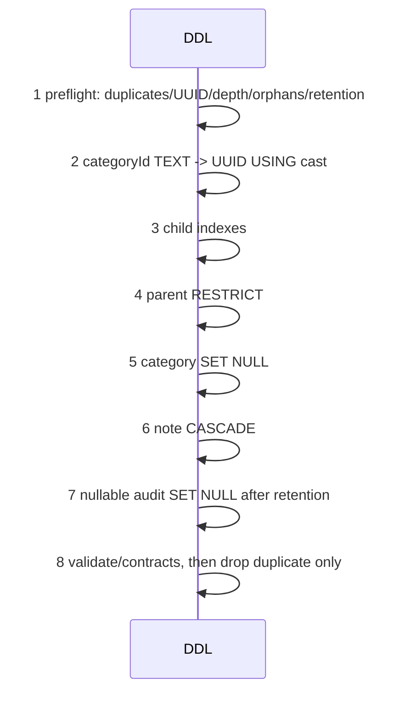

# Design: Ticket Physical Split S3

## Technical Approach

Keep thin facades. `TicketService` delegates once to `TicketQueryService` (query/cache), `TicketLifecycleService` (lifecycle/notes), or `TicketRepairService` (repair/integrity/channel). `TicketsCog` preserves registration over four flows; `bot/views/tickets.py` re-exports panel/intake, persistent actions, and ephemeral selectors. Existing `Database`/`GuildService` and cache-first patterns apply.

## Blast Radius

24 `is_mod` decorators (16 tickets, 8 sentinel; `unclaim` intentionally undecorated — claimer-or-mod inline check), 31 `TicketService` callers, and persistent `TicketActionsView` IDs/timeouts. Rollback is per child PR.

## Architecture Decisions

| Decision | Choice | Alternatives rejected | Rationale |
|---|---|---|---|
| Physical extraction | Composition, not `git mv`/mixins | Large add/delete diff; hidden `self`/MRO | Keeps 31 callers, imports, and view contracts stable while making ownership testable. |
| Service ownership | One query/cache, lifecycle/audit, and repair/transition owner | Shared helpers everywhere | Prevents duplicate mutation and invariants; repair keeps one `evaluate_repair_eligibility` seam. |
| FK actions | `parentId` RESTRICT; category SET NULL; note CASCADE; audit SET NULL | Cascading parents/audits; rejecting category deletion | Protects child history, preserves labels, removes dependent notes, and retains audits. Retention/nullable cleanup precedes audit FK; no audit `guildId` FK. |
| Index policy | Drop only `idx_ticket_guild_number` | Drop channel or advisor-listed indexes | It is shadowed and unused; channel lookup also serves closed tickets, and small cumulative stats are weak removal evidence. |
| Credential evidence | Probe opaque `sb_secret_`; PyJWT/JWKS only for legacy JWTs | Decode secret payload; trust PostgREST catalogs | Read-only `guild`/`ticket` access proves usable scope. Catalog parity needs staging DB/RPC because `pg_constraint` returns PGRST205. |
| Delivery/counts | Six stacked PRs for four workstreams; recalculate 24 decorators (16+8; unclaim is claimer-or-mod) | Four oversized PRs; stale 23/21 ledger | Authored move lines exceed review limits. Current count: 16 `tickets.py` + 8 `sentinel.py`; logic stays in `checks.py`. |

## Data Flow

```mermaid
sequenceDiagram
  participant P as PR stack
  participant G as Gates
  P->>G: S3.1 guardrails
  G->>P: S3.2 parity/DDL
  G->>P: S3.3A query/lifecycle
  G->>P: S3.3B repair/channel
  G->>P: S3.4A cog flows
  G->>P: S3.4B view seams
  G-->>P: parent stack; each <=800 lines; merge main
```



```mermaid
sequenceDiagram
  participant V as Verifier
  participant A as API probe
  participant C as Staging DB/RPC catalog
  V->>V: classify credential
  alt sb_secret_
    V->>A: read-only guild/ticket SELECT
  else legacy JWT
    V->>V: PyJWT/JWKS signature + algorithm allowlist
    V->>A: read-only health probe
  end
  V->>C: FK/RLS/publication/migration catalog read
  A-->>V: access evidence
  C-->>V: parity evidence
  V-->>V: require both; otherwise unresolved, no DDL/mutation
```

## File Changes

| File | Action | Description |
|---|---|---|
| `bot/services/ticket_service.py` | Modify | Thin facade. |
| `bot/services/ticket_query_service.py`, `ticket_lifecycle_service.py`, `ticket_repair_service.py` | Create | Ownership seams. |
| `bot/cogs/ticket_admin_flow.py`, `ticket_lifecycle_flow.py`, `ticket_notes_flow.py`, `ticket_integrity_flow.py` | Create | Four flows; `tickets.py` wrappers preserve hybrid registration. |
| `bot/views/ticket_panel.py`, `ticket_actions.py`, `ticket_category_select.py` | Create | Three seams; `tickets.py` re-exports names. |
| `bot/services/live_schema_verifier.py`, `schema_inventory.py`, `bot/config.py`, `bot/core/db/base.py` | Create/modify | Probe/catalog contracts. |
| `migrations/018_ticket_integrity_fks.sql` | Create | Ordered cast, indexes, FKs, validation, sole drop. |
| `tests/`, `bot/cogs/tickets.py`, `bot/views/tickets.py` | Modify | RED and contract coverage. |

## Interfaces / Contracts

`TicketService` preserves signatures. Seams accept `Database`, `TTLCache`, and Discord collaborators; `LiveSchemaVerifier.verify()` returns immutable `resolved/unresolved` evidence. Preflight/down evidence is read-only; application code never runs DDL.

## Testing Strategy

| Layer | What to Test | Approach |
|---|---|---|
| Unit | Delegation, repair gate, 24 decorators (16+8; unclaim claimer-or-mod), FK/index rules, credentials, IDs/timeouts | pytest fakes and structural RED tests. |
| Integration | Guild isolation, cache invalidation, catalog/RLS/publication/migration parity, API probe | Supabase doubles plus opt-in `live`; never mutate/DDL. |
| E2E | Discord workflow | N/A: disabled; persistent startup/callback contracts use integration tests. |

## Threat Matrix

| Boundary | Applicability | Safe/failure behavior and RED test |
|---|---|---|
| Documentation-like paths | N/A — no executable classification | None. |
| Git repository selection | Applicable — stacked delivery | Explicit parent/base; wrong cwd/ref fails; RED branch-manifest test. |
| Commit state | Applicable — child boundary | Reject mixed DDL/move/lint; RED diff-scope test. |
| Push state | Applicable — auto-chain | Explicit refspec/fast-forward; RED first/non-fast-forward tests. |
| PR commands | Applicable — six-child verification | Explicit head/base; RED composition/prefix test. |

## Migration / Rollout

Chain `S3.1 → S3.2 → S3.3A → S3.3B → S3.4A → S3.4B`, each ≤800 authored lines and independently green. S3.1 is code/lint; S3.2 owns backup, lock evidence, preflight abort, and DDL. Revert each child: guardrails, migration down/restore, facade, then cog/view seams. Never combine DDL, moves, and lint.

## Open Questions

- [ ] Confirm the staging DB/RPC credential and the retention action for the known audit orphan/mismatch before enabling the audit FK.
