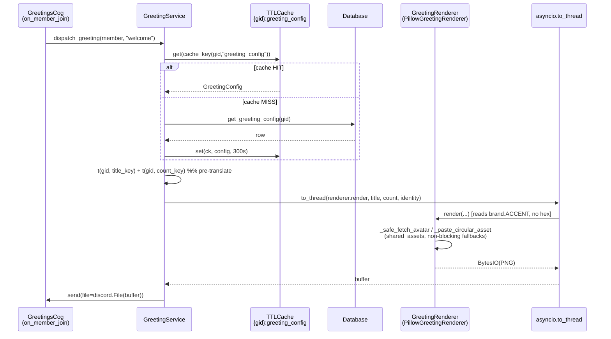
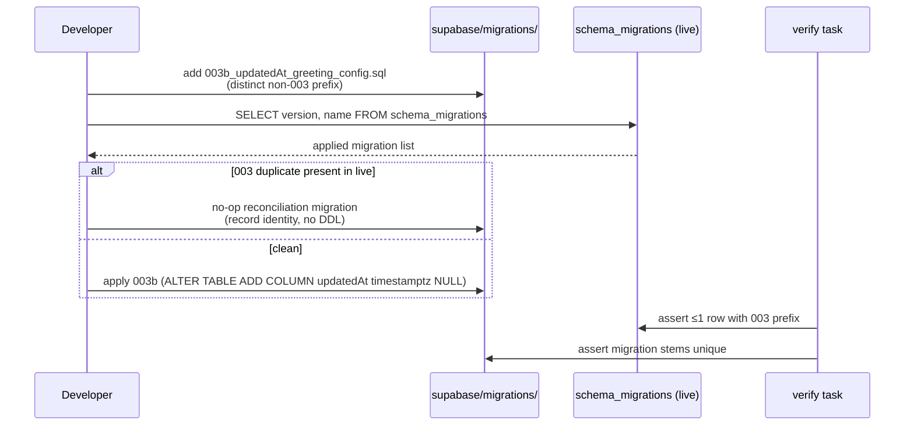
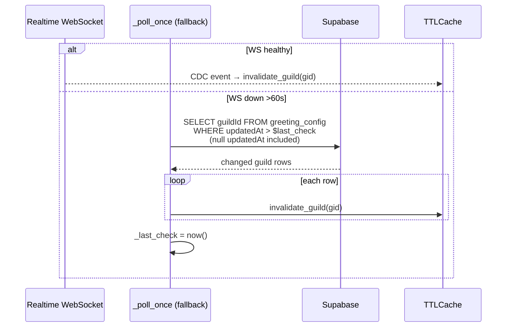

# Design: welcome-svg-foundation (Cycle 1 of 3)

> Minimal Nebulosa greeting on `python:3.11-slim` (no apt) via a Pillow-default
> `GreetingRenderer` interface, plus the SRP split of the 454-line `ImageService`
> and the hygiene/DRY cleanup. Cycle 2 (Neon SVG) swaps the renderer in 1 line.

## Technical Approach

Split `ImageService` (454L, owns both rank + greeting cards) into three
services-layer modules behind a thin `GreetingRenderer` Protocol, inject the
concrete `PillowGreetingRenderer` at `bot/bot.py:215`, rebrand the blurple
`#7289da` accent to `brand.ACCENT`, and remove the untested compat shim. Add an
additive `updatedAt` column so the Realtime poll fallback stops full-scanning
`greeting_config`. Hygiene/DRY closes the remaining gaps. All work follows
strict TDD (RED→GREEN→REFACTOR) and the cache-first + Realtime CDC pattern
(AGENTS.md / config.yaml `rules.design`).

## Architecture Decisions

| Decision | Options | Tradeoff | Choice & Rationale |
|---|---|---|---|
| **Renderer default** | (a) cairosvg-as-default, (b) Pillow-as-default + SVG interface, (c) resvg-python | (a) needs `libcairo`; Pterodactyl `python:3.11-slim` has no apt → `ImportError` at boot. (c) adds a Rust wheel outside calibrated scope. (b) ships today, keeps Cycle 2 swap at 1 line. | **(b) Pillow default** — calibrated decision: `cairosvg`→`cairocffi`→`libcairo` is NOT pure Python; slim has no apt. Pillow is already in `uv.lock` (`pillow>=11`); the Protocol makes Cycle 2 a 1-line injection change. |
| **Boot-time selection** | (a) fail-fast if cairosvg missing, (b) probe + log WARNING + Pillow fallback | (a) aborts startup in the real deployment env. (b) degrades gracefully, matches `_safe_fetch_avatar` catch-log-degrade shape. | **(b) probe + fallback** — probe `import cairosvg` at boot; on `ImportError`, inject `PillowGreetingRenderer`, log WARNING, continue. Single injection decision so Cycle 2 flips one line. Cycle 1 keeps Pillow even when probe succeeds (cairosvg path reserved). |
| **Poll fallback query** | (a) keep full-scan `select("guildId")`, (b) additive `updatedAt` + incremental `gt(updatedAt, $last_check)` | (a) O(all guilds) every 30s fallback cycle (realtime.py:734). (b) O(changed) + null treated as always-changed. | **(b) updatedAt incremental** — `_poll_once` (realtime.py:709) already full-scans `greeting_config`; `updatedAt` turns it into an incremental query, mirroring the existing `ticket.lastActivity` window. Additive column → pre-migration rows (null) are included, not silently skipped. |
| **Migration identity** | (a) raw rename `003_subtitles_notes.sql`→`003b`, (b) new non-`003` migration + live `schema_migrations` check | (a) desyncs `schema_migrations` on a live project (memory: prior staging drift). (b) additive, validated. | **(b) validate-or-reconcile** — never a raw file rename of a deployed migration. Ship a distinct non-`003` `updatedAt` migration; validate against live `schema_migrations` or ship a no-op reconciliation. |
| **DRY extraction** | (a) leave duplications, (b) extract to shared modules | (a) ~240 LOC debt remains. (b) single source of truth, reviewer-enforceable. | **(b) DRY** — `verifyGuildAdmin`×4→`dashboard/lib` guard; `_err`/`_ok`×4→`embeds.py`; `select("*")`×13→explicit columns; `INFO`×2→`brand.INFO`; shim→deleted. ~−240 LOC. |
| **`time.py` vs `timeparse.py`** | (a) merge, (b) keep separate + document | (a) collapses two unrelated domains (DB timestamp vs duration parsing). | **(b) DO NOT MERGE** — different domains; add docstrings stating separation. |

## Data Flow — Sequence Diagrams

### 1. Greeting dispatch (on_member_join → render → cache)



### 2. Hygiene 003 reconciliation (migration identity)



### 3. Realtime updatedAt incremental poll



## File Changes

| File | Action | Description |
|------|--------|-------------|
| `bot/services/greeting_renderer.py` | Create | `GreetingRenderer` Protocol + `PillowGreetingRenderer`; reads `brand.ACCENT`, `asyncio.to_thread`-safe, no hex, font `OSError`→`ImageFont.load_default()` |
| `bot/services/rank_renderer.py` | Create | `RankRenderer` owning `generate_rank_card`; output byte-identical |
| `bot/services/shared_assets.py` | Create | shared `_card_base`, gradient loop, `_load_font`, `_safe_fetch_avatar`, `_paste_circular_asset` (services layer, no cog/view imports) |
| `bot/services/image_service.py` | Modify | remove `generate_rank_card` + `generate_greeting_card` + helpers (delegated to renderers); keep as thin shim or delete if no callers |
| `bot/services/greeting_service.py` | Modify | depend on `GreetingRenderer` interface; delete `_generate_greeting_card_compatibly` (line 202); `dispatch_greeting` calls renderer via `to_thread` |
| `bot/bot.py` | Modify | line 215: probe cairosvg → inject `PillowGreetingRenderer` (default); pass to `GreetingService` |
| `bot/cogs/greetings.py` | Modify | `/welcome_test` + `/goodbye_test` call renderer via `to_thread`; DRY kwargs assembly |
| `bot/utils/brand.py` | Modify | re-export greeting accent token (single source); no palette value change |
| `bot/cogs/ticket_admin_flow.py`, `bot/cogs/ticket_notes_flow.py` | Modify | remove local `INFO = from_str("#5865F2")`; import `brand.INFO` |
| `bot/utils/embeds.py` | Modify | add shared `_err`/`_ok`/`_info` helpers used by 4 cogs |
| `bot/core/db/greeting_db.py` | Modify | `get_greeting_config`/`upsert_greeting_config` round-trip `updatedAt`; upsert sets `updatedAt = now()` |
| `bot/models/greeting_config.py` | Modify | add `updated_at: datetime \| None`; `from_db_row`/`to_db_dict` preserve `updatedAt` |
| `bot/core/realtime.py` | Modify | `_poll_once`: query `greeting_config` by `updatedAt > $last_check`; null included |
| `supabase/migrations/003b_updatedAt_greeting_config.sql` | Create | `ALTER TABLE greeting_config ADD COLUMN "updatedAt" timestamptz NULL` (additive; distinct non-003 prefix) |
| `dashboard/lib/verifyGuildAdmin.ts` | Create | single shared guard; 4 action files import + pass error string |
| `dashboard/lib/actions/{economy,guild,greeting,ticket}-actions.ts` | Modify | import shared guard; replace 4 local defs; replace `select("*")` with explicit columns |
| `bot/utils/time.py`, `bot/utils/timeparse.py` | Modify | docstrings state the other is a separate domain; DO NOT MERGE |
| `pyproject.toml` | Modify | `version` 0.1.0 → 0.8.0 |
| `.gitignore` | Modify | add `.ty_cache/`, `.hypothesis/`, `*.tsbuildinfo`, `**/.next/` |
| `openspec/config.yaml` | Modify | `mypy`→`ty`, `0.70`→`0.75`, `400`→`800` |
| `README.md` | Create | what NebulosaBot is, how to run, architecture brief |
| `.env.example` | Modify | document all bot/Discord/feature vars (3→~12) |
| `.github/workflows/code-quality.yml` | Modify | SHA-pin `jscpd`, `vulture`, all external actions |
| `AGENTS.md` | Modify | document cairosvg `libcairo` constraint, `cache_key` guild-scoping, `time.py`/`timeparse.py` do-not-merge |

## Interfaces / Contracts

```python
# bot/services/greeting_renderer.py
from typing import Protocol, runtime_checkable
import io


@runtime_checkable
class GreetingRenderer(Protocol):
    """Render a branded greeting card PNG from pre-translated strings.

    Implementations MUST NOT resolve translations (no t() calls).
    Identity inputs (avatar, guild icon) are fetched off the event loop;
    callers wrap render() in asyncio.to_thread.
    """

    def render(
        self,
        *,
        username: str,
        avatar_url: str | None,
        guild_name: str,
        member_count: int,
        card_type: str,  # "welcome" | "goodbye"
        greeting_title: str,  # pre-translated
        member_count_text: str,  # pre-translated
        guild_icon_url: str | None,
    ) -> io.BytesIO: ...


class PillowGreetingRenderer:
    """Cycle 1 default. Accent from bot.utils.brand.ACCENT (no hex)."""

    __slots__ = ("_assets",)

    def __init__(self) -> None: ...
    def render(self, **kwargs) -> io.BytesIO: ...  # via shared_assets
```

## Testing Strategy

| Layer | What to Test | Approach |
|-------|-------------|----------|
| Unit | `PillowGreetingRenderer.render` brand tokens, no-hex, font `OSError` fallback, missing avatar/icon fallbacks | RED first (TDD): assert no `#7289da`/`GREETING_ACCENT`; assert `brand.ACCENT` used; mock font `OSError`→`ImageFont.load_default()` |
| Unit | cairosvg probe: ImportError → Pillow + WARNING, no abort | patch `import cairosvg` to raise; assert `PillowGreetingRenderer` injected, log WARNING, startup proceeds |
| Unit | `RankRenderer` output byte-identical to pre-split | golden-image / bytes-equal before & after |
| Unit | `GreetingConfig.updated_at` round-trip; null preserved | `from_db_row`/`to_db_dict` with/without `updatedAt` |
| Unit | `RealtimeCacheSubscriber._poll_once` incremental `updatedAt > $last_check`; null included | mock builder; assert null-`updatedAt` row invalidates; `last_check` advances |
| Unit | `verifyGuildAdmin` shared guard; `select("*")` absent | grep assertions + behavior tests |
| Integration | greeting dispatch end-to-end through interface (mock renderer) | verify `GreetingService` depends on Protocol, not concrete |
| Integration | migration 003 identity (≤1 `003` prefix; live `schema_migrations` check) | on-disk + live-mock parity |

## Threat Matrix

N/A — no routing, shell, subprocess, VCS/PR automation, executable-file
classification, or process-integration boundary. cairosvg is imported via a
guarded `import` probe (no shell, no subprocess); font/asset failures are
caught `OSError`/`Exception` with non-breaking fallbacks. The chained-PR
delivery (PR1 hygiene/DRY, PR2 renderer) is an orchestrator decision, not a
process-integration surface in the shipped code.

## Failure Modes & Mitigations

| Failure | Mitigation |
|---|---|
| `cairosvg` ImportError at boot | Pillow default + WARNING log; startup proceeds (probe+fallback) |
| Font file missing (`Inter-Regular.ttf`) | `OSError` → `ImageFont.load_default()` + WARNING; card still renders |
| Migration desync (003 duplicate on live) | validate against `schema_migrations` or ship no-op reconciliation; never raw rename |
| 800-line review budget overrun | auto-chain: PR1 hygiene/DRY, PR2 renderer — each solo-revertible |
| Cross-guild cache leak | new caches use `cache_key(guild_id, entity)` (utils layer, not duplicated) |
| Avatar/guild-icon fetch failure | `_safe_fetch_avatar` catch-log-degrade; placeholder rendered, delivery proceeds |

## Migration / Rollout

- **Schema**: additive `ALTER TABLE greeting_config ADD COLUMN "updatedAt" timestamptz NULL` — pre-migration rows read `null`; upsert sets `now()`. No data backfill required; null treated as "always changed" by the poll.
- **003 duplicate**: validate against live `schema_migrations` before applying; ship no-op reconciliation if already deployed.
- **Rollback**: `git revert` PR2 (renderer split) — restart flushes cache; `git mv 003b_*` revert + live fixup. Each slice solo-revertible; `uv run pytest --cov=bot` ≥75% after rollback.

## Open Questions

- [x] Confirm `image_service.py` retains any caller after the split (verify before delete vs. thin shim).
      **Resolved (Cycle 1 correction):** `image_service.py` is retained as a
      **DEPRECATED delegating shim**, not deleted. `bot/cogs/stellar.py:318`
      still calls `self.bot.image_service.generate_rank_card`, and the legacy
      + PR2 test suites mock `bot.image_service.generate_{rank,greeting}_card`.
      Removing the method would break those callers and exceed the Cycle 1
      correction budget. The shim owns NO rendering logic — it forwards to
      `RankRenderer` / `PillowGreetingRenderer` (the spec R-1/WG-4 owners).
      The `GREETING_ACCENT` RGBA constant on the shim is a legacy back-compat
      value for tests that patch `ImageService`; the branded source of truth
      is `bot.utils.brand.GREETING_ACCENT` (== `brand.ACCENT`). Full removal is
      deferred until `stellar.py` and the legacy suites migrate to the
      renderers directly. Spec R-1 "ImageService no longer owns rank card" is
      satisfied in substance (ownership moved to `RankRenderer`); the on-disk
      delegating method is intentional back-compat, documented as DEPRECATED.
- [x] Exact `dashboard/lib` module name for the shared guard (`verifyGuildAdmin.ts` vs. `guards.ts`) — proposal says `guards.ts`, follow project convention.
      **Resolved:** shared guard lives at `dashboard/lib/guards.ts` (matches
      project convention); four action files import it and pass their
      domain-specific admin error string.

## Next Step

Ready for tasks (sdd-tasks).
